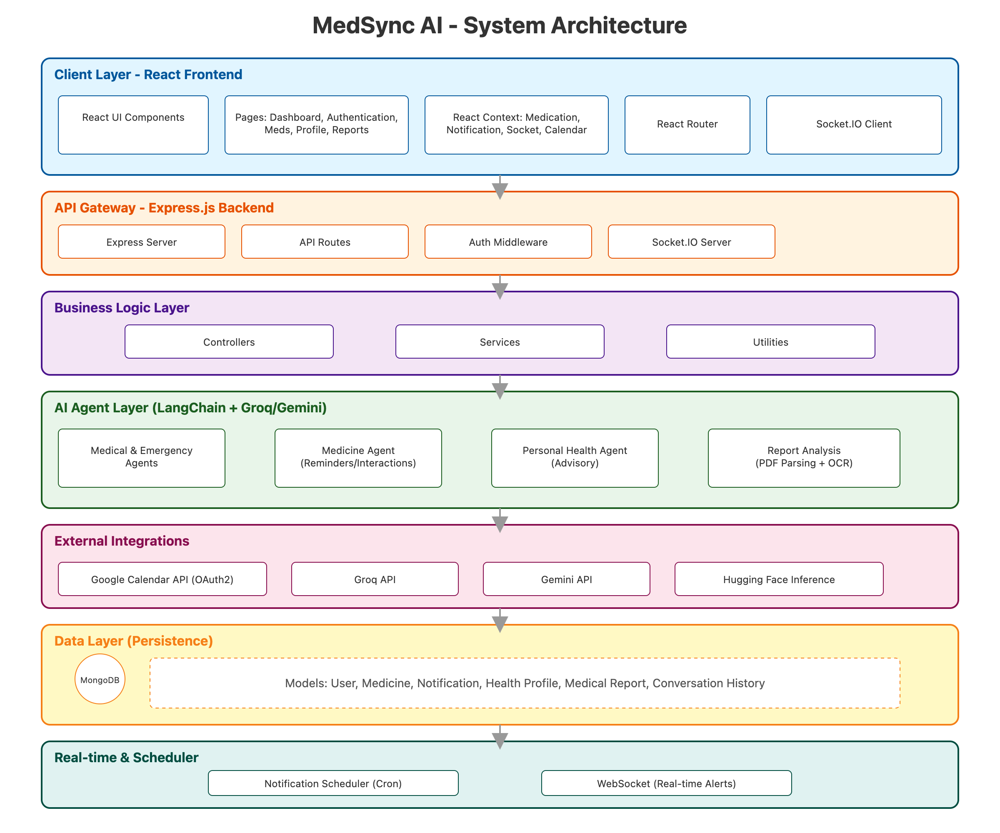

# MedSync AI - System Architecture

> **Labels:** `documentation`, `help wanted`

This document provides a comprehensive overview of the MedSync AI system architecture, including component interactions, data flow, and technology stack.

---

## 📊 Architecture Diagram



The architecture diagram above illustrates the complete system architecture of MedSync AI, showing the flow between:

- **Client Layer (React Frontend)** - User interface, pages, context providers, and Socket.IO client
- **API Gateway (Express.js Backend)** - Express server, routes, middleware, and Socket.IO server
- **Business Logic Layer** - Controllers, services, utilities, and authentication middleware
- **AI Agent Layer** - Medical, Emergency, Medicine, and Personal Health agents using LangChain + Groq
- **External Services** - Google Calendar API, Groq API, Gemini API, and Hugging Face API
- **Data Layer** - MongoDB database with all data models (User, Medicine, Notification, Health Profile, Report, Conversation)
- **Real-time Communication** - Notification scheduler and WebSocket connections for real-time updates

---

## 🔄 Component Flow

### 1. Authentication Flow

```
User → Login/Signup Page → POST /api/auth/login
→ Auth Controller → JWT Generation → MongoDB (User Model)
→ Response with JWT Token → Frontend stores token
→ Protected Routes check token via Auth Middleware
```

### 2. Medication Management Flow

```
User → Add Medication Page → POST /api/medicine
→ Auth Middleware validates JWT
→ Medicine Controller → Medicine Model → MongoDB
→ Notification Scheduler creates reminders
→ Google Calendar Sync (if enabled) → Google Calendar API
→ Response → Frontend updates Medication Context
```

### 3. Real-time Notification Flow

```
Notification Scheduler (cron-like) → Checks Medicine Model
→ Finds due medications → Creates Notification Model
→ Socket.IO Server emits to user room
→ Socket.IO Client receives → Notification Context updates
→ UI displays notification toast
```

### 4. AI Agent Chat Flow

```
User → Agents Page → Select Agent Type → POST /api/agents/{type}
→ Auth Middleware validates JWT
→ Agent Controller → LangChain Handler (medical_model.js, etc.)
→ LangChain → Groq/Gemini API → LLM Response
→ Conversation Model stores history → MongoDB
→ Response → Frontend displays in chat UI
```

### 5. Report Analysis Flow

```
User → Reports Page → Upload PDF → POST /api/agents/upload
→ Multer handles file upload → pdf-parse extracts text
→ Report Analysis Utility → LLM (Groq/Gemini) → Analysis
→ Report Model stores analysis → MongoDB
→ User → Chat with Report → POST /api/agents/chat
→ Report Analysis retrieves context → LLM → Response
```

### 6. Google Calendar Sync Flow

```
User → Connect Calendar Page → OAuth2 Flow
→ GET /api/oauth/login → Google OAuth2
→ Callback → /api/oauth/callback → Stores tokens in User Model
→ Add Medication → Calendar Sync Controller
→ Google Calendar API → Creates events → User's Google Calendar
```

---

## 🏗️ System Components

### Frontend (React)

**Location:** `client/src/`

**Key Components:**
- **Pages:** Dashboard, Login, Signup, AddMedication, Agents, Reports, Analytics, HealthProfile, ConnectCalendar, Notifications
- **Components:** Navbar, NotificationToast, ProtectedRoute
- **Context Providers:**
  - `medicationContext.jsx` - Medication state management
  - `notificationContext.jsx` - Notification state
  - `socketContext.jsx` - Socket.IO connection management
  - `calendarSyncContext.jsx` - Calendar sync state
- **Services:** `socketService.js` - Socket.IO client wrapper

**Technologies:**
- React 19.2.0 (Vite)
- React Router DOM 7.9.3
- Tailwind CSS 4.1.14
- Socket.IO Client 4.8.1
- Axios 1.12.2
- Recharts 3.2.1

---

### Backend (Express.js)

**Location:** `server/src/`

**Key Components:**

#### Routes (`server/src/routes/`)
- `auth.js` - Authentication (signup, login)
- `medicineRoutes.js` - Medication CRUD
- `notificationRoutes.js` - Notification management
- `agentsRoutes.js` - AI agent endpoints
- `reportRoutes.js` - Report upload and chat
- `healthRoutes.js` - Health profile management
- `calendarSyncRoutes.js` - Google Calendar sync
- `oauth.js` - OAuth2 callback handling
- `analytics.js` - Analytics endpoints

#### Controllers (`server/src/api/`)
- `addMedicineController.js` - Medication creation
- `statusMedicineController.js` - Medication status updates
- `todaysMedicineController.js` - Today's medications
- `notificationController.js` - Notification scheduling and delivery
- `analyticsController.js` - Analytics calculations
- `calendarSyncController.js` - Calendar sync operations
- `reportController.js` - Report handling

#### Models (`server/src/models/`)
- `User.js` - User schema (auth, Google tokens)
- `medicineModel.js` - Medication schema
- `todayMedicine.js` - Daily medication tracking
- `todayNotifications.js` - Notification schema
- `HealthProfile.js` - User health profile
- `ReportModel.js` - Medical report storage
- `ConversationModel.js` - AI conversation history

#### Utilities (`server/src/utils/`)
- `medical_model.js` - Medical AI agent (LangChain)
- `emergency_model.js` - Emergency triage agent
- `medicine_model.js` - Medication-specific agent
- `personal_health_model.js` - Personal health advisor
- `reportAnalysis.js` - PDF parsing and analysis
- `googleCalendar.js` - Google Calendar API integration

#### Middleware (`server/src/middlewares/`)
- `authMiddleware.js` - JWT token validation

#### Services (`server/src/services/`)
- `sendNotification.js` - Notification delivery service

**Technologies:**
- Express.js 5.1.0
- Socket.IO 4.8.1
- MongoDB 6.20.0 + Mongoose 8.19.0
- LangChain 0.3.35
- JWT (jsonwebtoken 9.0.2)
- Google APIs (googleapis 161.0.0)
- Multer 2.0.2
- pdf-parse 1.1.1

---

## 🔌 External Integrations

### AI/LLM Providers

1. **Groq API** (`@langchain/groq`)
   - Primary LLM provider
   - Used by all AI agents
   - Model: `llama-3.3-70b-versatile`

2. **Google Gemini** (`@langchain/google-genai`)
   - Secondary LLM provider
   - Fallback or alternative responses

3. **Hugging Face** (`@huggingface/inference`)
   - Optional for specialized models

### Google Calendar API

- **OAuth2 Flow:** User authorizes → Tokens stored → Calendar events created
- **Integration:** Medication schedules synced as calendar events
- **Library:** `googleapis` 161.0.0

---

## 💾 Data Models

### User Model
- Authentication credentials (email, hashed password)
- JWT tokens
- Google OAuth2 tokens (for Calendar sync)
- Profile information

### Medicine Model
- Medication details (name, description, dosage)
- Schedule (dosage times, frequency, start/end dates)
- User association
- Status tracking

### Notification Model
- Notification content (title, message)
- User association
- Timestamp and status
- Type (medication reminder, etc.)

### Health Profile Model
- User health information
- Medical history
- Allergies, conditions

### Report Model
- Uploaded PDF reports
- Extracted text
- AI-generated analysis
- User association

### Conversation Model
- AI agent conversation history
- User messages and AI responses
- Agent type
- Timestamps

---

## 🔄 Real-time Communication

### Socket.IO Architecture

1. **Server-side:** Socket.IO server initialized with Express HTTP server
2. **Client-side:** Socket.IO client connects on app load
3. **Rooms:** Users join personal rooms (`user-${userId}`) for targeted notifications
4. **Events:**
   - `join-user` - User joins their notification room
   - `notification` - Server emits notifications to user rooms
   - `disconnect` - Handle client disconnections

### Notification Scheduler

- Checks medication schedules periodically
- Creates notifications for due medications
- Emits via Socket.IO to user rooms
- Stores notifications in MongoDB

---

## 🔒 Security Architecture

1. **Authentication:** JWT-based authentication
   - Tokens stored in HTTP-only cookies or localStorage
   - Auth middleware validates tokens on protected routes

2. **Authorization:** Role-based access (future enhancement)
   - Currently: User-scoped data access

3. **API Security:**
   - CORS configured for allowed origins
   - Input validation (express-validator)
   - Password hashing (bcryptjs)

4. **Environment Variables:**
   - All secrets stored in `.env` files
   - Never committed to repository
   - Separate configs for client and server

---

## 📈 Scalability Considerations

### Current Architecture
- Monolithic Express server
- Direct MongoDB connections
- In-memory Socket.IO connections
- File-based notification scheduling

### Future Enhancements
- **Microservices:** Separate notification service, AI service
- **Message Queue:** Redis/RabbitMQ for notification delivery
- **Caching:** Redis for frequently accessed data
- **Load Balancing:** Multiple server instances
- **Database Sharding:** For large-scale user base
- **CDN:** For static assets
- **Containerization:** Docker for consistent deployments

---

## 🧪 Testing Strategy

### Current State
- Manual testing via Postman/cURL
- Frontend manual testing
- No automated test suite

### Recommended Testing
- **Unit Tests:** Jest for utilities and models
- **Integration Tests:** Supertest for API endpoints
- **Component Tests:** React Testing Library for UI components
- **E2E Tests:** Playwright/Cypress for full user flows
- **Socket.IO Tests:** Test real-time communication

---

## 📚 Additional Resources

- [README.md](./README.md) - Project overview and quick start
- [CONTRIBUTING.md](./CONTRIBUTING.md) - Contribution guidelines
- [SECURITY.md](./SECURITY.md) - Security best practices

---

## 🔄 Data Flow Summary

```
User Action
    ↓
React Frontend (UI/Context)
    ↓
HTTP Request / WebSocket
    ↓
Express Routes + Auth Middleware
    ↓
Controllers / Services
    ↓
┌─────────────────┬─────────────────┐
│   MongoDB       │   External APIs  │
│   (Data Store)  │   (AI/Calendar)  │
└─────────────────┴─────────────────┘
    ↓
Response / Socket.IO Event
    ↓
Frontend Update
    ↓
UI Re-render
```

---

**Last Updated:** 2024

For questions or clarifications about the architecture, please open a GitHub Discussion or Issue.
